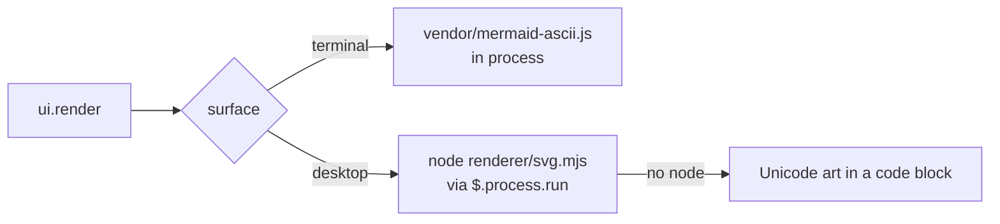

# claude-gfm-render

A [Claude Code](https://claude.com/claude-code) mod that draws the GitHub Flavored Markdown bits the transcript leaves as plain text: alerts, task lists, strikethrough and Mermaid diagrams.

It hooks `ui.render` on `AssistantMessage`, so it changes how a reply is **drawn**, never the message itself (`ctrl+o` still shows the original).

| Markdown | Terminal | Desktop / VS Code / mobile |
|---|---|---|
| `> [!NOTE]`, `[!TIP]`, `[!IMPORTANT]`, `[!WARNING]`, `[!CAUTION]` | colored rounded box with a title | same |
| `- [ ]` / `- [x]` | ☐ / ☑ | left to the native renderer |
| `~~text~~` | struck through with U+0336 | left to the native renderer |
| ` ```mermaid ` | Unicode box drawing | SVG following the light or dark scheme |

Code blocks and inline code are never rewritten. A block with nothing to draw goes to the native renderer untouched.

## Install

> [!NOTE]
> Function hooks (mods) are an early-access API of Claude Code and may change between releases. Built and tested on Claude Code 2.1.286.

```bash
git clone https://github.com/briangtn/claude-gfm-render.git ~/perso/claude-gfm-render
```

For one session:

```bash
claude --plugin-dir ~/perso/claude-gfm-render
```

For every session, terminal and desktop app alike, add it to the `env` block of `~/.claude/settings.json`:

```json
{
  "env": {
    "CLAUDE_CODE_PLUGIN_DIRS": "~/perso/claude-gfm-render"
  }
}
```

The folder is watched: editing a file reloads the mod in the running session.

## Mermaid

Diagrams are rendered by [beautiful-mermaid](https://github.com/lukilabs/beautiful-mermaid): flowcharts, state, sequence, class, ER and XY charts. Anything else (`gantt`, `pie`, `mindmap`, …), a syntax error, or a diagram too wide for the terminal falls back to the code block. A fence is drawn only once its closing ```` ``` ```` has streamed in.

Two renderers, because a hooks module may not import a file over 1 MiB and has no `eval`, while the ELK layout engine the SVG needs weighs 1.6 MB:



- **Terminal**: `hooks/vendor/mermaid-ascii.js`, the ASCII renderer alone (84 KB), imported by the mod.
- **Desktop / VS Code / mobile**: `renderer/svg.mjs` run by `node` (must be on the session's `PATH`), once per diagram, then cached.

## Develop

```bash
npm test                # claude plugin test .
npm run validate        # claude plugin validate .
npm run build:vendor    # rebuild both Mermaid bundles with bun
```

| File | Role |
|---|---|
| `hooks/register.tsx` | the `ui.render` hook and the SVG process call |
| `hooks/gfm.ts` | splits a reply into markdown, alert and mermaid blocks; task-list and strikethrough rewrites |
| `hooks/mermaid.ts` | Unicode art sized to the terminal, SVG theming |
| `hooks/gfm.test.tsx` | tests, run on every surface |
| `renderer/svg.mjs` | Mermaid on stdin, SVG on stdout |

## License

MIT. The vendored bundles carry their own licenses: beautiful-mermaid (MIT, `renderer/LICENSE-beautiful-mermaid`) and elkjs (EPL-2.0, `renderer/LICENSE-elkjs`).
