<div align="center">

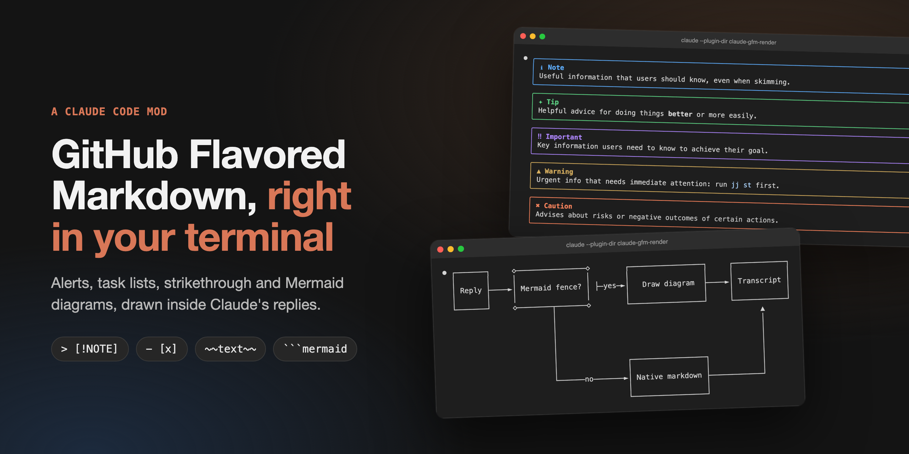

# claude-gfm-render

**Alerts, task lists, strikethrough and Mermaid diagrams, drawn inside Claude Code's replies.**

[](https://claude.com/claude-code)
[](#install)
[](hooks/gfm.test.tsx)
[](LICENSE)

[Install](#install) · [Before / after](#before--after) · [What it handles](#what-it-handles) · [How it works](#how-it-works)

</div>

---

Claude writes GitHub Flavored Markdown all day: `> [!WARNING]` callouts, `- [ ]` checklists, ```` ```mermaid ```` diagrams. The terminal shows them as raw text. This mod draws them, without touching the message itself (`ctrl+o` still shows the original).

## Install

```bash
git clone https://github.com/briangtn/claude-gfm-render.git ~/perso/claude-gfm-render
claude --plugin-dir ~/perso/claude-gfm-render
```

To load it in every session, terminal and desktop app alike, add it to `~/.claude/settings.json`:

```json
{
  "env": {
    "CLAUDE_CODE_PLUGIN_DIRS": "~/perso/claude-gfm-render"
  }
}
```

> [!NOTE]
> Mods (function hooks) are an early-access API of Claude Code and may change between releases. Built and tested on Claude Code 2.1.286 and 2.1.287. No build step: the mod is plain files, and the folder is watched, so an edit reloads it in the running session.

## Before / after

Real `claude` sessions (100 columns, captured with `tmux`); *before* is the same reply without the mod.

<table>
  <tr>
    <th width="50%">Before</th>
    <th width="50%">With claude-gfm-render</th>
  </tr>
  <tr>
    <td>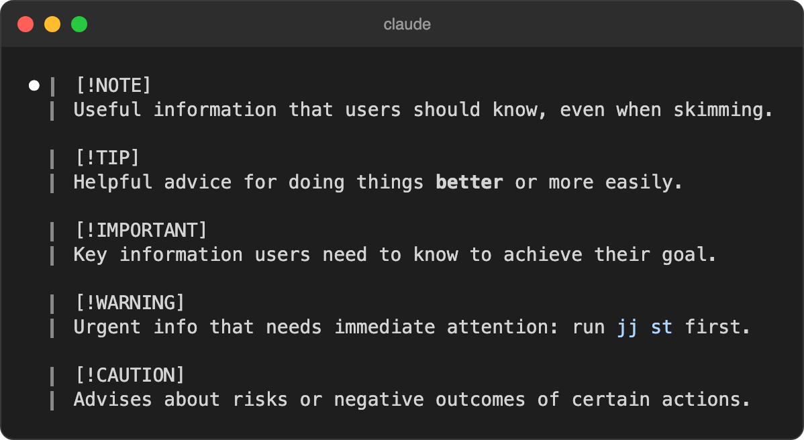</td>
    <td>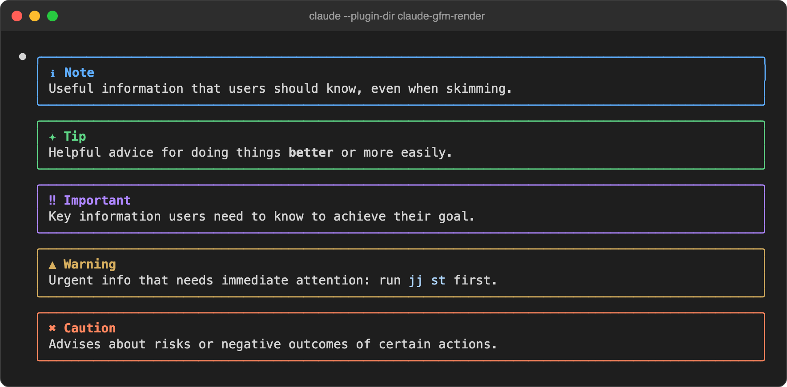</td>
  </tr>
  <tr>
    <td>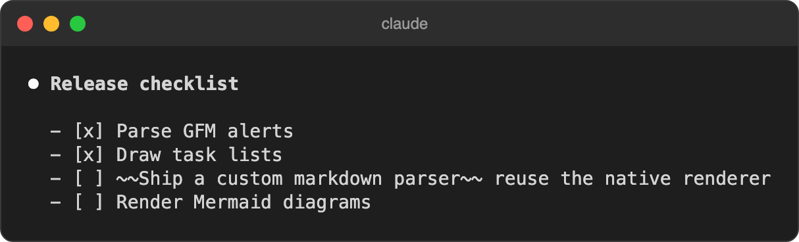</td>
    <td>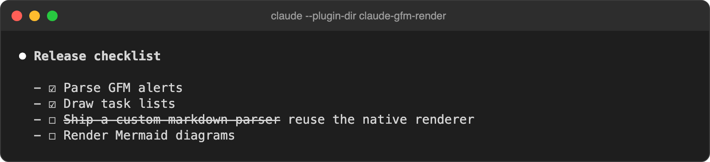</td>
  </tr>
  <tr>
    <td>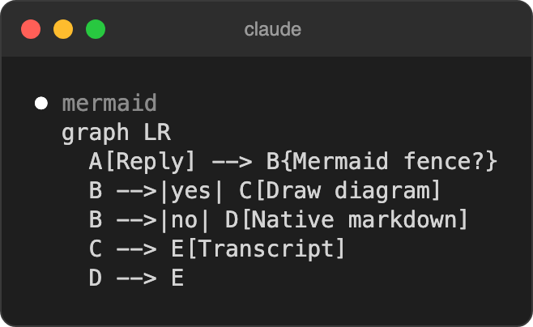</td>
    <td>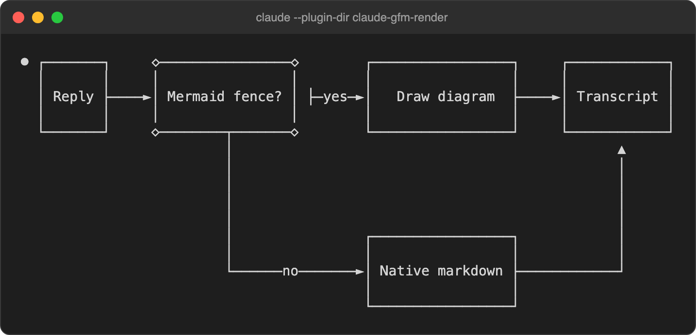</td>
  </tr>
</table>

<details>
<summary><b>Sequence diagrams too</b></summary>
<br>
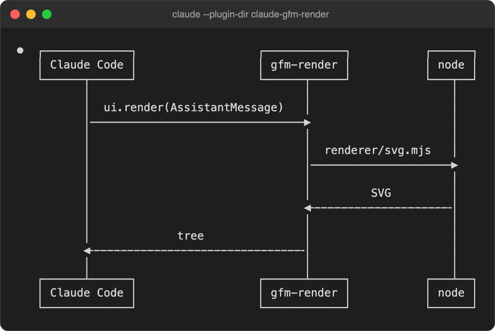
</details>

### On desktop, VS Code and mobile

Mermaid becomes a real SVG that follows the light or dark scheme. Below, the mod's own output rendered by Chrome (not a capture of the app):

<picture>
  <source media="(prefers-color-scheme: dark)" srcset="docs/screenshots/desktop-flow-dark.png">
  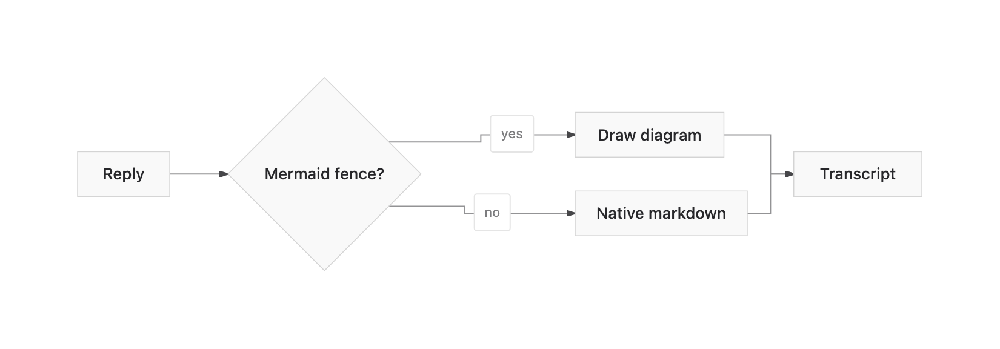
</picture>

<details>
<summary><b>Sequence diagram, light and dark</b></summary>
<br>

| Light | Dark |
|---|---|
| 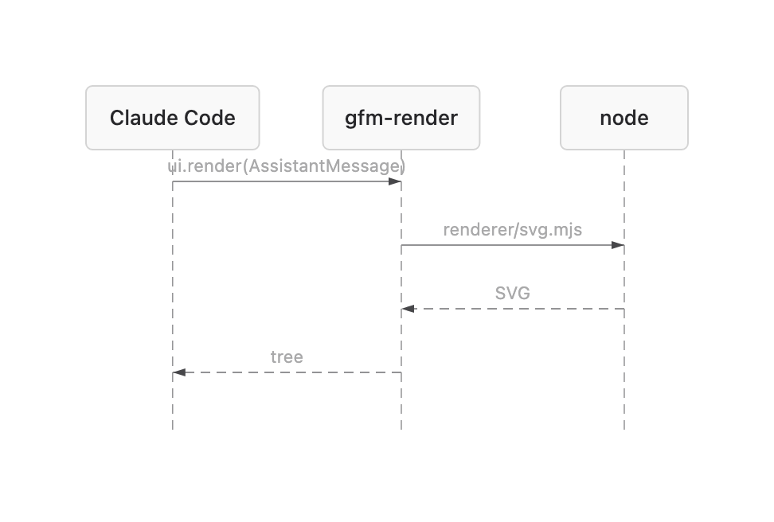 | 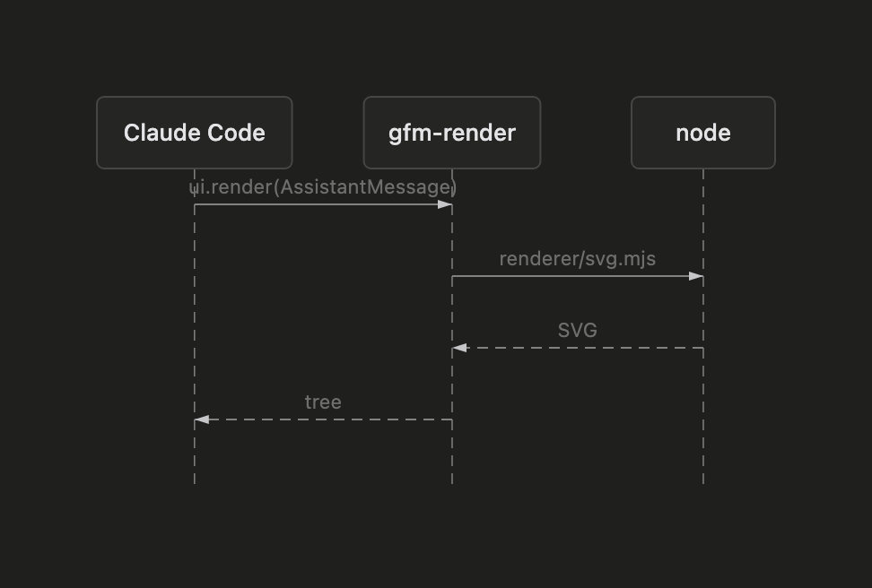 |

</details>

## What it handles

| | Markdown | Terminal | Desktop · VS Code · mobile |
|:--:|---|:--:|:--:|
| 💬 | Alerts `> [!NOTE]` `[!TIP]` `[!IMPORTANT]` `[!WARNING]` `[!CAUTION]`, any markdown inside | ✅ colored box | ✅ colored box |
| ☑️ | Task lists `- [ ]` / `- [x]` (also `*`, `+`, `1.`) | ✅ ☐ / ☑ | ➖ native |
| ~~S~~ | Strikethrough `~~text~~` | ✅ | ➖ native |
| 🔀 | Mermaid flowchart / graph | ✅ Unicode art | ✅ SVG |
| 🧭 | Mermaid sequence, state, class, ER, xychart | ✅ Unicode art | ✅ SVG |
| 🔒 | Code fences and inline code | never rewritten | never rewritten |
| 📝 | Everything else (headings, tables, links, emphasis…) | native | native |

<details>
<summary><b>What it does not handle</b></summary>
<br>

| Case | What you get |
|---|---|
| Mermaid `gantt`, `pie`, `mindmap`, `gitGraph`, `journey`, `timeline`, `quadrantChart`, `sankey`, C4… | the code block, as written |
| Mermaid with a syntax error, or wider than the terminal even with tighter spacing | the code block |
| Mermaid on desktop without `node` on the session's `PATH` | the Unicode art in a code block |
| Single-line Mermaid (`graph TD; A-->B`) | may fail to parse: write one statement per line |
| An alert nested in a list item or in another blockquote (`> > [!NOTE]`) | a plain blockquote |
| A reply still streaming in | the native rendering until the alert or the closing ```` ``` ```` arrives |
| A single reply block over 10,000 characters | the native rendering of that block |
| Footnotes, emoji shortcodes, `#123` / `@user` autolinks, `$math$`, raw HTML | left to the native renderer |
| Your own messages and tool output | untouched: only Claude's replies are drawn |

Known glitch: in the terminal, an edge label leaving a `{decision}` node can show a stray `├` (beautiful-mermaid's ASCII layout, visible in the flowchart above).

</details>

## How it works

The mod hooks `ui.render` on `AssistantMessage`: every text block of a reply goes through it, gets split into markdown, alert and Mermaid segments, and comes back as a tree the surface draws. A block with nothing to draw goes to the native renderer untouched.

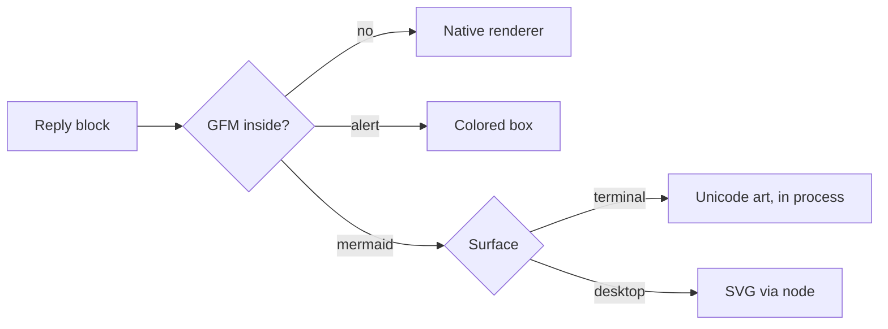

Mermaid is rendered by [beautiful-mermaid](https://github.com/lukilabs/beautiful-mermaid), split in two because a hooks module may not import a file over 1 MiB and has no `eval`, while the ELK layout engine the SVG needs weighs 1.6 MB:

- **Terminal**: `hooks/vendor/mermaid-ascii.js`, the ASCII renderer alone (84 KB), imported by the mod.
- **Desktop / VS Code / mobile**: `renderer/svg.mjs` run by `node`, once per diagram, then cached.

## Develop

```bash
npm test                # claude plugin test .
npm run validate        # claude plugin validate .
npm run build:vendor    # rebuild both Mermaid bundles with bun
```

| File | Role |
|---|---|
| `hooks/register.tsx` | the `ui.render` hook and the SVG process call |
| `hooks/gfm.ts` | splits a reply into blocks; task-list and strikethrough rewrites |
| `hooks/mermaid.ts` | Unicode art sized to the terminal, SVG theming |
| `hooks/gfm.test.tsx` | tests, run on every surface |
| `renderer/svg.mjs` | Mermaid on stdin, SVG on stdout |

Issues and PRs welcome, especially screenshots from other terminals and the desktop app.

## License

MIT. Vendored bundles keep their own licenses: [beautiful-mermaid](https://github.com/lukilabs/beautiful-mermaid) (MIT) and [elkjs](https://github.com/kieler/elkjs) (EPL-2.0), in `renderer/`.
