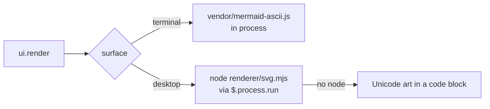

# claude-gfm-render

A [Claude Code](https://claude.com/claude-code) mod that draws the GitHub Flavored Markdown bits the transcript leaves as plain text: alerts, task lists, strikethrough and Mermaid diagrams.

It hooks `ui.render` on `AssistantMessage`, so it changes how a reply is **drawn**, never the message itself (`ctrl+o` still shows the original).


## Screenshots

Every terminal screenshot is a real `claude` session (Claude Code 2.1.287, 100 columns), captured with `tmux` and the reply asked verbatim; *before* is the same session without the mod.

### Alerts

| Before | With the mod |
|---|---|
|  |  |

### Task lists and strikethrough

| Before | With the mod |
|---|---|
|  |  |

### Mermaid in the terminal

| Before | With the mod |
|---|---|
|  |  |


### Mermaid on desktop

The SVG the mod hands the desktop app, VS Code and mobile, in each color scheme (rendered by Chrome from the mod's own output, not captured in the app):

<picture>
  <source media="(prefers-color-scheme: dark)" srcset="docs/screenshots/desktop-flow-dark.png">
  
</picture>

| Light | Dark |
|---|---|
|  |  |

## What it handles

| Markdown | Terminal | Desktop / VS Code / mobile |
|---|:--:|:--:|
| Alerts: `> [!NOTE]`, `[!TIP]`, `[!IMPORTANT]`, `[!WARNING]`, `[!CAUTION]`, with any markdown inside | ✅ colored box | ✅ colored box |
| Task lists `- [ ]` / `- [x]` (also `*`, `+`, `1.`) | ✅ ☐ / ☑ | ➖ native renderer |
| Strikethrough `~~text~~` | ✅ U+0336 | ➖ native renderer |
| ` ```mermaid ` flowchart / graph | ✅ Unicode art | ✅ SVG |
| ` ```mermaid ` sequenceDiagram, stateDiagram, classDiagram, erDiagram, xychart | ✅ Unicode art | ✅ SVG |
| Code fences and inline code | untouched | untouched |
| Anything else (headings, tables, links, emphasis, …) | native renderer | native renderer |

## What it does not handle

| Case | What you get |
|---|---|
| Mermaid `gantt`, `pie`, `mindmap`, `gitGraph`, `journey`, `timeline`, `quadrantChart`, `sankey`, C4, … | the code block, as written |
| Mermaid with a syntax error | the code block |
| Mermaid wider than the terminal, even with tighter spacing | the code block |
| Mermaid on desktop without `node` on the session's `PATH` | the Unicode art in a code block |
| Single-line Mermaid (`graph TD; A-->B`) | may fail to parse; write one statement per line |
| An alert nested in a list item or in another blockquote (`> > [!NOTE]`) | a plain blockquote |
| A reply still streaming in | the native rendering until the alert or the closing ```` ``` ```` arrives |
| A single reply block over 10,000 characters | the native rendering of the whole block |
| Footnotes `[^1]`, emoji shortcodes `:tada:`, `#123` / `@user` / SHA autolinks, `$math$`, raw HTML (`<details>`, …) | left to the native renderer |
| Your own messages and tool output | only Claude's replies are drawn |

Known glitch: in the terminal, an edge label leaving a `{decision}` node can show a stray `├` beside the label (beautiful-mermaid's ASCII layout, visible in the flowchart above).

## Install

> [!NOTE]
> Function hooks (mods) are an early-access API of Claude Code and may change between releases. Built and tested on Claude Code 2.1.286 and 2.1.287.

```bash
git clone https://github.com/briangtn/claude-gfm-render.git ~/perso/claude-gfm-render
```

For one session:

```bash
claude --plugin-dir ~/perso/claude-gfm-render
```

For every session, terminal and desktop app alike, add it to the `env` block of `~/.claude/settings.json`:

```json
{
  "env": {
    "CLAUDE_CODE_PLUGIN_DIRS": "~/perso/claude-gfm-render"
  }
}
```

The folder is watched: editing a file reloads the mod in the running session.

## How Mermaid is drawn

Diagrams are rendered by [beautiful-mermaid](https://github.com/lukilabs/beautiful-mermaid). Two renderers, because a hooks module may not import a file over 1 MiB and has no `eval`, while the ELK layout engine the SVG needs weighs 1.6 MB:



- **Terminal**: `hooks/vendor/mermaid-ascii.js`, the ASCII renderer alone (84 KB), imported by the mod.
- **Desktop / VS Code / mobile**: `renderer/svg.mjs` run by `node`, once per diagram, then cached. The SVG carries its own light and dark colors.

## Develop

```bash
npm test                # claude plugin test .
npm run validate        # claude plugin validate .
npm run build:vendor    # rebuild both Mermaid bundles with bun
```

| File | Role |
|---|---|
| `hooks/register.tsx` | the `ui.render` hook and the SVG process call |
| `hooks/gfm.ts` | splits a reply into markdown, alert and mermaid blocks; task-list and strikethrough rewrites |
| `hooks/mermaid.ts` | Unicode art sized to the terminal, SVG theming |
| `hooks/gfm.test.tsx` | tests, run on every surface |
| `renderer/svg.mjs` | Mermaid on stdin, SVG on stdout |

## License

MIT. The vendored bundles carry their own licenses: beautiful-mermaid (MIT, `renderer/LICENSE-beautiful-mermaid`) and elkjs (EPL-2.0, `renderer/LICENSE-elkjs`).
